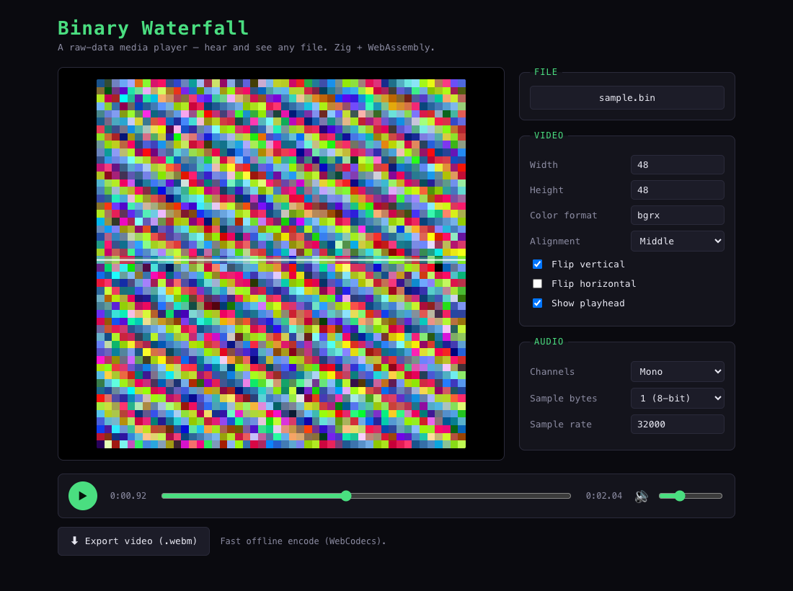

# Binary Waterfall

**A raw-data media player that runs entirely in your browser.** Drop in *any*
file and it plays it: the raw bytes *are* the audio, and a scrolling window of
those same bytes *is* the video. You see exactly what you hear.

🌊 **[Live demo →](https://jaenster.github.io/binary-waterfall/)**



This is a **Zig + TypeScript** port of
[nimaid/binary-waterfall](https://github.com/nimaid/binary-waterfall) (originally
Python/PyQt). The byte-crunching core is written in **Zig, compiled to
WebAssembly**; the UI is a **Vite + React** SPA. No server, no uploads — your
files never leave your machine.

## Features

- 🎨 Real-time waterfall visualization of any file's raw bytes
- 🔊 Raw bytes played back as PCM audio, in sync with the video
- 🎛️ Live controls — resolution, color format, channels, sample rate/size, flips, alignment
- 🎚️ Built-in limiter so no file can be painfully loud
- 🎬 **Export to `.webm`** (video + audio) — offline WebCodecs encode, faster than real-time
- 🔒 100% client-side — nothing is uploaded anywhere

## How it works

- **Audio** — the file's raw bytes are reinterpreted as PCM samples
  (`sample_bytes` 1–4 → 8/16/24/32-bit, mono or stereo, arbitrary sample rate;
  8-bit is unsigned, the rest signed little-endian) and decoded to Float32 for
  the Web Audio API.
- **Video** — each pixel consumes `color_bytes` bytes according to a
  color-format string. A `width × height` window scrolls through the file, its
  position synced to the audio playback time — that scrolling *is* the waterfall.
- **Color format** codes (default `bgrx`): `r` `g` `b` = color channels,
  `w` = white/grayscale, `x` = unused byte. Capitalize a letter to invert that
  channel (e.g. `R`). Grayscale (`w`) can't be mixed with `r`/`g`/`b`.
- A stable **playhead** line marks the current read position.

Because both audio and video read the *same* bytes, an executable, a font, a JPEG
and a ZIP each get their own unmistakable look and sound.

## Controls

| Action | Key |
|-|-|
| Play / pause | `Space` |
| Seek ±2s | `←` / `→` |
| Scrub | drag the timeline |

Load a file by dropping it on the viewer or clicking to browse. The Video and
Audio panels change the visualization live.

## Tech notes

- **`src/core.zig`** compiles to a ~3 KB `public/core.wasm`. It does the hot path:
  per-frame byte→pixel conversion and PCM→Float32 audio decoding. Faithful to the
  original algorithm down to Python's round-half-to-even.
- **Video export** uses the browser's native **WebCodecs** encoder (VP8 + Opus,
  muxed with [`webm-muxer`](https://github.com/Vanilagy/webm-muxer)), so a clip
  encodes offline at several times real-time. Falls back to a real-time
  `MediaRecorder` capture where WebCodecs isn't available.

## Build & run

Requires [Zig](https://ziglang.org/) 0.16+ and Node 18+.

```sh
npm install
npm run dev      # builds the wasm, then starts Vite
npm run build    # wasm + type-check + production bundle into dist/
```

Rebuild just the WebAssembly core:

```sh
npm run wasm
# = zig build-exe src/core.zig -target wasm32-freestanding \
#     -fno-entry -O ReleaseSmall -rdynamic -femit-bin=public/core.wasm
```

## Project layout

```
src/core.zig      Zig core → public/core.wasm (frame + audio decoding)
app/wasm.ts       WASM loader + memory management wrapper
app/player.ts     Web Audio playback (clock, limiter, recording tap)
app/export.ts     WebCodecs / MediaRecorder video export
app/App.tsx       React UI (viewer, settings, transport, export)
```

## Credit

All credit for the concept and the original implementation goes to
[nimaid](https://github.com/nimaid/binary-waterfall). This is an independent
browser port.

## License

MIT
